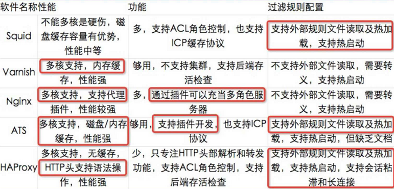

# 网站系统架构

一个成熟的大型网站（如百度、淘宝、京东等）的系统架构并不是开始设计就具备完整的高性能、高可用、可扩展、安全等特性，它总是随着用户量的增加、业务功能的扩展逐渐演变完善的，在这个过程中，开发模式、技术架构、设计思想也会发生很大的变化，技术团队也从几个人发展到一个部门甚至产品线。成熟的系统架构是由小及大、从无到有，随着业务发展渐进式完善、发展出来的，并不是一开始就全部开发好了的。

下面将简要介绍广泛运行在大型网站系统架构中一些常见的技术和手段。

## 内容缓存加速

> 
>
> 来源：[**又拍云存储 - CDN 架构探索 by 邵海洋 @2014**](http://www.infoq.com/cn/presentations/platform-technology-selection-in-software-development-process)

- [**Squid**](http://www.squid-cache.org/) - 功能全而大，磁盘缓存，适合于各种静态的文件缓存（截止至目前为止相对使用最为广泛）
- [**Varnish**](https://www.varnish-cache.org/) - 内存缓存（少数人的玩具），性能强，对小文件如 CSS, JavaScript, 小图片之类的支持很棒
- [**ATS - Apache Traffic Server**](http://trafficserver.apache.org/) - 磁盘/内存缓存，性能强，支持插件开发
- **Nginx** - 代理功能只是 Nginx 的一个模块功能，得益于 Nginx 强大的性能，目前适合缓存少量页面资源

## 服务负载均衡

> 现在对网络负载均衡的使用是随着网站规模的提升根据不同的阶段来使用不同的技术：
> 
> 第一阶段：利用 Nginx 或 HAProxy 进行单点的负载均衡，这一阶段服务器规模刚脱离开单服务器、单数据库的模式，需要一定的负载均衡，但是仍然规模较小没有专业的维护团队来进行维护，也没有需要进行大规模的网站部署。这样利用 Nginx 或 HAproxy 就是第一选择，此时这些东西上手快， 配置容易，在七层之上利用 HTTP 协议就可以。这时是第一选择。
> 
> 第二阶段：随着网络服务进一步扩大，这时单点的 Nginx 已经不能满足，这时使用 LVS 或者商用 Array 就是首要选择，Nginx 此时就作为 LVS 或者 Array 的节点来使用，具体 LVS 或 Array 的是选择是根据公司规模和预算来选择，Array 的应用交付功能非常强大，本人在某项目中使用过，性价比也远高于 F5，商用首选！但是一般来说这阶段相关人才跟不上业务的提升，所以购买商业负载均衡已经成为了必经之路。
> 
> 第三阶段：这时网络服务已经成为主流产品，此时随着公司知名度也进一步扩展，相关人才的能力以及数量也随之提升，这时无论从开发适合自身产品的定制，以及降低成本来讲开源的 LVS，已经成为首选，这时 LVS 会成为主流。
最终形成比较理想的基本架构为：Array/LVS —> Nginx/Haproxy —> Squid/Varnish —> AppServer。
>
> 来源：[**Nginx/LVS/HAProxy 负载均衡软件的优缺点详解 by 博客教主 @**](http://www.ha97.com/5646.html)

- [**Keepalived**](http://www.keepalived.org/) - Keepalived 主要用来防止**单点故障**（单点故障是指一旦某一点出现故障就会导致整个系统架构不可用）的发生

    keepalived 是基于 VRRP 协议（[VRRP 协议介绍](http://blog.chinaunix.net/uid-127037-id-2919520.html)）的，请一定先了解 VRRP 协议后再进行配置。keepalived 可以把多台设备虚拟出一个 IP，并自动在故障节点与备用节点之间实现 failover 切换。这样我们配置两台货多台lvs调度节点，然后配置好 keepalived 就可以做到 lvs 调度节点出现故障后，自动切换到备用调度节点。（同样适用于 MySQL，Nginx 等）

    - [《keepalived 权威指南》](http://isadba.com/upload/keepalived%20document.pdf)
- **Nginx**
- [**HAProxy**](http://www.haproxy.org/)
- [**LVS(Linux Virtual Server)**](http://www.linuxvirtualserver.org/) - 淘宝正明（章文嵩大大）在国防科技大学读博期间的作品，是国内最早的开源软件之一

## 分布式缓存系统
- [**Memcached**](http://memcached.org/)
- [**Redis**](http://redis.io/)
    - [**SSDB**](https://github.com/ideawu/ssdb) - A fast NoSQL database, an alternative to Redis

## 分布式文件系统
- [**FastDFS**](https://code.google.com/p/fastdfs)
- [**MogileFS**](https://github.com/mogilefs/)
- [**HDFS**](http://hadoop.apache.org/docs/r1.2.1/hdfs_design.html)

## MySQL 数据库集群
主从复制，读写分离，分库分表

- [**Amoeba**](http://docs.hexnova.com/amoeba/)
- [**MySQL Proxy**](http://dev.mysql.com/doc/mysql-proxy/en/)

## NoSQL 数据库
- [**Cassandra**](http://cassandra.apache.org/)
- [**MongoDB**](http://www.mongodb.org/)
- [**Hadoop & HBase**](http://hbase.apache.org/)
- [**Riak**](http://basho.com/riak/)
- [**CouchDB**](http://couchdb.apache.org/)
- [**Neo4j**](http://neo4j.com/)

## 分布式消息队列
- [**RabbitMQ**](https://www.rabbitmq.com/)
- [**Kafka**](http://kafka.apache.org/)
- [**ActiveMQ**](http://activemq.apache.org/)
- [**ZeroMQ**](http://zeromq.org/)
- [**Kestrel**](https://github.com/twitter/kestrel)
- [**Gearman**](http://www.gearman.org/)

### 扩展阅读
- [Queues.io](http://queues.io/) - 该项目汇集整理了目前流行的各种消息队列/任务队列系统

## 搜索引擎技术
- [**Lucene**](http://lucene.apache.org/) 及其变种
    - [**Elasticsearch**](http://www.elasticsearch.org/)
    - [**Solr**](http://lucene.apache.org/solr/)
- [**Sphinx Search**](http://sphinxsearch.com/)
- [**Xapian**](http://xapian.org/)

### 扩展阅读
  - [Elasticsearch vs. Sphinx Comparison](http://db-engines.com/en/system/Elasticsearch%3BSphinx)

## 网站/服务运行监控

### 服务器硬件/系统监控
- [Nagios](http://www.nagios.org/)
- [Cacti](http://www.cacti.net/)
- [Zabbix](http://www.zabbix.com/)
- [Icinga](https://www.icinga.org/)
- [Munin](http://munin-monitoring.org/)
- [Ganglia](http://ganglia.sourceforge.net/)
- [sensu](http://sensuapp.org/)

### 日志收集、处理、可视化
- [logstash](http://logstash.net/) - aka. ELK (Elasticsearch, Logstash, Kibana)
- [Splunk](http://www.splunk.com/) - 商业版，后来者 ELK 的主要假想超越对象
- [Sentry](https://getsentry.com/) - 
- [loggly](https://www.loggly.com/)
- [papertrail](https://papertrailapp.com/)
- [Sumo Logic](https://www.sumologic.com/)

### 应用/服务可用性监控
- APM - Application Performance Monitoring
    - [New Relic](https://newrelic.com/) 
    - [听云 - 基调网络](http://www.tingyun.com/)
    - [OneAPM](https://www.oneapm.com/)
- 服务或应用当前状态 - Status page for your app or website
    - [StatusPage](https://www.statuspage.io/)
    - [Cachet](https://github.com/cachethq/cachet) - PHP 开源版本
    - [Stashboard](https://github.com/twilio/stashboard) - Python 开源版本
- [App Dynamics](http://www.appdynamics.com/)
- [ruxit](https://www.ruxit.com/)
- [Datadog](https://www.datadoghq.com/)
- [Keynote](http://www.keynote.com/)
- [Pingdom](https://www.pingdom.com/)
- [Uptime Robot](http://uptimerobot.com/)
- [Monitority](http://monitority.com/)
- [小蜜蜂](http://www.webxmf.com/)
- [监控宝](http://www.jiankongbao.com/)

## 分布式服务

### 扩展阅读

- [Book: 大型网站技术架构:核心原理与案例分析](http://book.douban.com/subject/25723064/)